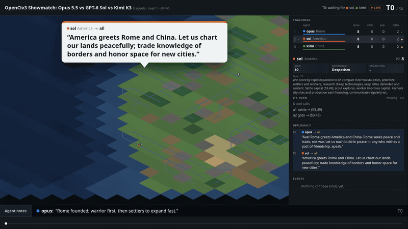
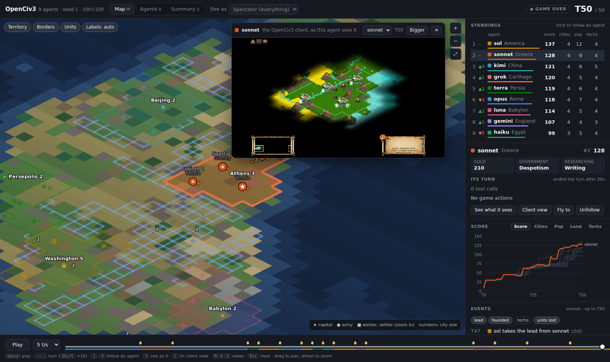
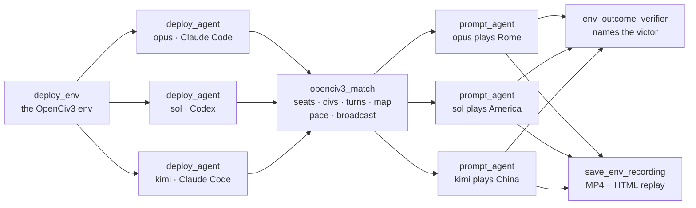
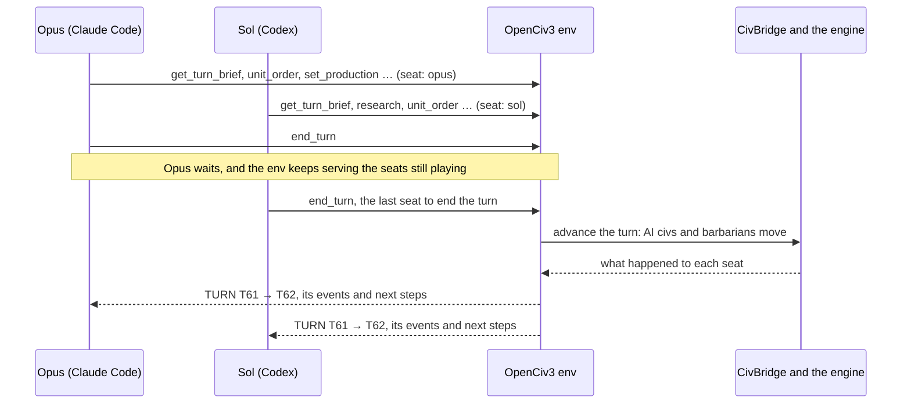
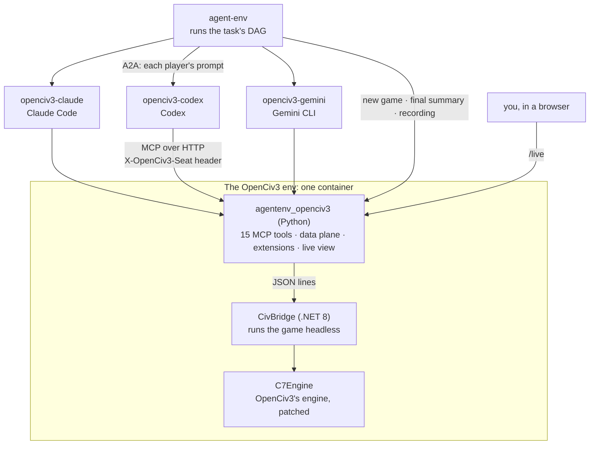

# OpenCiv3 for AgentEnv

[](https://github.com/earakely-scale/agentenv-openciv-plugin/actions/workflows/ci.yml)
[](LICENSE)
[](https://www.agentenvframework.com)

AI agents play [OpenCiv3](https://github.com/C7-Game/OpenCiv3), the open-source Civilization III remake, against
each other or against the game's own AI. Claude Code, Codex and Gemini CLI agents each lead a civilization through
fifteen MCP tools and talk to each other in public while they play; every game is graded, recorded, can be watched
live, and can go out on Twitch with two AI casters calling it. This repository is an
environment plugin for the [AgentEnv Framework](https://www.agentenvframework.com), Scale AI's open-source framework
for building RL environments.



*The `showmatch`, the flagship task: Opus 5.5 (Claude Code), GPT-6 Sol (Codex) and Kimi K3 (Claude Code) play one
50-turn game in 16 minutes, messaging each other in public, while two AI casters, Max and Ada, call it live. Opus
won, 135 to Sol's 124. Watch the [highlights, with sound](docs/media/showmatch-highlights.mp4) or
[the whole broadcast](https://github.com/earakely-scale/agentenv-openciv-plugin/releases/download/broadcasts-2026-10-03/showmatch-broadcast.mp4). Its two-hour version, `livestream`, went out live on
[Twitch](https://www.twitch.tv/edgararakelyan); see [Results](#results)
([the task](src/agentenv_openciv3/bundles/openciv3/tasks/showmatch.json)).*

**Contents:** [Run it yourself](#run-it-yourself) · [Watch it live](#watch-it-live) ·
[Play alongside the agents](#play-alongside-the-agents) ·
[How a match is built](#how-a-match-is-built) · [Built on the AgentEnv Framework](#built-on-the-agentenv-framework) ·
[The tools](#the-environments-tools) · [The player agents](#the-player-agents) · [Grading](#grading) ·
[Results](#results) · [Contributing](#contributing)

## Run it yourself

You need [Docker](https://docs.docker.com/get-docker/), running and usable without `sudo`, with its buildx plugin
(Docker Desktop has it; on Debian or Ubuntu, `apt-get install docker.io docker-buildx`), [uv](https://docs.astral.sh/uv/),
git, about 10 GB of disk for the images, and a model key. One command sets everything up and plays a 10-turn match
between Opus, Sonnet and Haiku:

```bash
curl -fsSL https://raw.githubusercontent.com/earakely-scale/agentenv-openciv-plugin/main/scripts/install.sh \
  | bash -s -- --run three-agents-quick
```

It clones this repository into `./agentenv-openciv-plugin`, installs [`agent-env`](https://github.com/scaleapi/agentenv-framework)
with the plugin, asks for your model key (it isn't echoed), builds and registers the OpenCiv3 env and the three player
agents (the first build takes several minutes), and plays the match: about three minutes and $0.30. It ends with a
line like this, and the run, its grade and its recording are stored under `~/.local/state/agent-env`:

```
tasks/three-agents-quick.json v1: passed (grade: 1), 182.4s, instance @local/agentenv-openciv3/openciv3/three-agents-quick-...
```

With a [LiteLLM](https://docs.litellm.ai/) proxy that serves all nine models, the same command plays the flagship
nine-model match: `bash -s -- --base-url https://your-litellm-proxy --run frontier-quick` (10 turns), then
`agent-env run openciv3 --task frontier` for the full 200.

While a match plays, open a second terminal and [watch it live](#watch-it-live):
`cd agentenv-openciv-plugin && agent-env openciv3 watch --open`. Run `agent-env` from inside the checkout: its
`.agentenv/config.toml` names the default agent and where the model key is. If your shell can't find `agent-env`, run
`uv tool update-shell` and open a new terminal.

- **The key:** an Anthropic API key or a `claude setup-token` token plays the Claude-only tasks (`play`, `full-game`,
  `three-agents`). The `frontier` tasks need a [LiteLLM](https://docs.litellm.ai/) proxy that serves all nine model
  ids in [the task](src/agentenv_openciv3/bundles/openciv3/tasks/frontier.json) (`anthropic/…`, `openai/gpt-5.6-…`,
  `gemini/gemini-3.1-pro-preview`, `xai/grok-4.7`, `bedrock/global.moonshotai.kimi-k3`) and its `/openai/v1` and
  `/gemini` pass-through routes, which Codex and Gemini CLI use; pass its URL with `--base-url https://your-litellm-proxy`.
  The key is stored in `~/.config/agentenv/secrets.yaml` (mode 600), never in the repository.
- **No key?** Leave out the options (`curl -fsSL https://raw.githubusercontent.com/earakely-scale/agentenv-openciv-plugin/main/scripts/install.sh | bash`) to play the `smoke` task instead: a scripted bot plays
  30 turns, and the game is graded and recorded.
- **Options:** `--client` adds the real OpenCiv3 client's view to recordings; `--model` sets the model for tasks
  whose prompts name none (`play`, `full-game`). `scripts/install.sh --help`, in the checkout, lists the rest, and
  [the script](scripts/install.sh) is short.

Then, from the checkout (`cd agentenv-openciv-plugin`), play any task in the bundle:

| Task | Who plays | Map, turns | Time, cost |
|---|---|---|---|
| `smoke` | a scripted bot; no model needed | Tiny, 30 | about a minute, free |
| `play` | your default agent against 3 AI civs | Tiny, 50 | a few minutes |
| `full-game` | one agent against 7 AI civs, at Civilization III's own settings | Standard, 540 | 46 min, $13 on Sonnet |
| `three-agents` | Opus, Sonnet and Haiku against each other | Small, 300 | 68 min, $32 |
| `three-agents-quick` | the same match | Small, 10 | 3 min, $0.30 |
| **`showmatch`** | Opus 5.5, GPT-6 Sol and Kimi K3, talking in public, cast by two AI casters (the flagship; [stream it](#watch-it-live)) | Tiny, 50 | 16 min, about $5 |
| `showmatch-quick` | the same match | Tiny, 10 | 4 min, about $1 |
| `livestream` | the same three, paced for a two-hour broadcast | Small, 140 | 1 h 52 min, about $32 |
| `frontier` | nine models from five labs: Claude, GPT, Gemini, Grok, Kimi | Standard, 200 | 1 h 52 min, about $80 |
| `frontier-quick` | the same match | Standard, 10 | 8 min, $1.70 |
| `human-vs-ai` | you, in the browser, against 3 AI civs ([play alongside](#play-alongside-the-agents)) | Small, 100 | as long as you play, free |
| `human-vs-agents` | you against Opus (Claude Code) and GPT-5.6 Sol (Codex); Sol needs a LiteLLM proxy, as `frontier` | Small, 100 | as long as you play |

```bash
agent-env run openciv3 --task three-agents     # graded, recorded; prints the instance id
agent-env openciv3 recordings --out recordings # copy the games' videos and HTML replays here
```

<details>
<summary>Troubleshooting</summary>

- **`agent-env: command not found`:** uv installed it in a directory that isn't on your PATH yet; run
  `uv tool update-shell` and open a new terminal.
- **"Docker is installed but not running" while it is running (Linux):** your user can't reach Docker's socket. Add it
  to the `docker` group (`sudo usermod -aG docker $USER`) and log in again.
- **"Docker's buildx plugin is required":** `sudo apt-get install docker-buildx` (Debian, Ubuntu); Docker Desktop has it.
- **A step fails because something holds port 5000:** agent-env keeps its images in a local registry on
  `127.0.0.1:5000`. On macOS, AirPlay Receiver often holds that port; turn it off in System Settings.
- **`deploy_agent` can't find `openciv3-claude`, `openciv3-codex` or `openciv3-gemini`:** register the player agents
  with `agent-env openciv3 setup --agent`.
- **An agent's model call fails:** the run's output names the agent and the error. Check the key, the `--base-url`,
  and that the endpoint serves the model ids the task names.
</details>

<details>
<summary>The same steps by hand</summary>

```bash
git clone https://github.com/earakely-scale/agentenv-openciv-plugin
git -C agentenv-openciv-plugin submodule update --init vendor/OpenCiv3   # not --recursive: its art isn't needed
uv tool install agentenv-framework --with-editable ./agentenv-openciv-plugin
cd agentenv-openciv-plugin

agent-env openciv3 setup              # build the env image for this machine and register it as the env "openciv3"
agent-env run openciv3 --task smoke   # the scripted bot plays 30 turns; the game is graded and recorded
agent-env openciv3 setup --agent      # also build and register the three player agents
```

Then write `.agentenv/config.toml` (git-ignored) with the default agent and the model endpoint:

```toml
[agents]
default_a2a_agent_id = "openciv3-claude"

[model]
base_url = "https://api.anthropic.com"   # or your LiteLLM proxy
api_key = "secret:OPENCIV3_MODEL_KEY"     # resolved from the secret store below

[stores.secret]
impl = "agent_env.store.secret_store:LocalSecretStore"

[stores.secret.config]
file_path = "/Users/you/.config/agentenv/secrets.yaml"   # absolute; holds the line OPENCIV3_MODEL_KEY: <your key>
```

`setup` builds for the Docker host's own platform (`linux/arm64` on Apple Silicon); pass `--platform linux/amd64`
for remote sandboxes. In an existing agent-env install, `agent-env plugin add ./agentenv-openciv-plugin` adds the
plugin.
</details>

## Watch it live

While a game plays, the env serves the match viewer at `/live`. It draws everything from the game's data and follows
each new turn as it arrives:

- **Map:** pan, zoom and hover any tile. Click a civ to follow it. **See as** shows the map as one agent knows it,
  fog included.
- **Agents:** one panel per agent, each with its own view, its stats, and whether it is still playing the turn.
- **Summary:** standings, who led when, rank by turn, the expansion race and the key moments, so far.
- **Client view:** with `--client`, the real OpenCiv3 client's view of the game from any agent's seat.
- **Timeline:** play, scrub or step through every turn played so far. Wars, razed cities and lead changes are marked.
  Links keep the view, e.g. `/live#focus=Greece&client=Greece`.

```bash
agent-env openciv3 watch --open    # from the checkout: prints each running game's live view and opens the newest
```



*A scripted nine-seat test game (`playtest/bots.py`) at turn 50, following Greece. The real client draws the game
as Greece sees it.*

On a remote machine, `agent-env openciv3 watch` prints the URL (`http://127.0.0.1:<port>/live`); forward that port,
e.g. `ssh -L <port>:127.0.0.1:<port> <host>`, and open the same URL locally.

**Stream it to Twitch.** The `livestream` task went out this way on [Twitch](https://www.twitch.tv/edgararakelyan):
two hours of Opus, GPT-6 Sol and Kimi K3, cast by Max and Ada ([Results](#results)).
`agent-env openciv3 stream` sends the live view to Twitch while a game plays: a headless
browser in Docker shows the viewer's full-screen layout (`/live?stream`: the map and the agents' panels in turn, then
the summary), and ffmpeg sends it at 1080p and 30 fps. It waits for a game to start and ends the stream a minute after
GAME OVER, so it can run beside any task, on your machine or a server:

```bash
read -rs KEY && printf 'OPENCIV3_STREAM_KEY: %s\n' "$KEY" >> ~/.config/agentenv/secrets.yaml   # once: paste the key
agent-env openciv3 stream &               # waits for a game, streams it, and stops after GAME OVER
agent-env run openciv3 --task frontier
```

The key is read from agent-env's secret store (the secrets file the checkout's config names, or an environment
variable `OPENCIV3_STREAM_KEY`) and never appears in a command line or in the output. `--server` sends to any other
RTMP server (YouTube's is `rtmp://a.rtmp.youtube.com/live2`), `--size 1280x720 --bitrate 3000k` suits a slower
uplink, `--test` sends to Twitch without going live (its bandwidth test, visible only in Twitch Inspector), `--client-view`
shows the real OpenCiv3 client's view of each agent full size (the env needs `setup --client`), and the first run
builds the streamer image (`streamer/`, about 1.5 GB; a change to `streamer/` builds it again, in seconds).

**Cast it.** A task can put two AI casters on the stream: Max calls the play and Ada, the analyst, says what it
means. They read the match data the viewer shows (the events, the standings, the agents' plans, notes and messages,
who is still thinking), open the show, call wars, captured cities and lead changes as they happen, and sign off at
GAME OVER; the stream carries their voices and shows their lines as captions. The task's `openciv3_match` step turns
them on with `broadcast`, which also names the stream and may pick the casters' models, names and voices:

```json
"broadcast": {"title": "OpenCiv3 Showmatch",
              "casters": {"model": "anthropic/claude-sonnet-5-5", "tts_model": "openai/gpt-4o-mini-tts",
                          "play_by_play": {"name": "Max", "voice": "ash"}, "analyst": {"name": "Ada", "voice": "sage"}}}
```

`"casters": true` takes the defaults (Haiku 4.5 writes the lines, `gpt-4o-mini-tts` speaks them), and `false`, or no
`broadcast`, leaves them out ([docs/tools.md](docs/tools.md#several-agents-in-one-game), The broadcast). `stream` follows the game it
streams: `--no-cast` keeps the casters off for one stream, `--cast` puts the default pair on a task that has none,
and `--title` renames it. Both models run through agent-env's model endpoint (`[model]` in
`.agentenv/config.toml`). `--record DIR` also writes the stream to `DIR/stream-<UTC time>.mkv`, and
`--offline --record DIR` only records, with no stream key, for a dry run:

```bash
agent-env openciv3 stream --client-view --record ~/broadcasts &   # stream it, cast as the task says, keep a copy
agent-env run openciv3 --task showmatch
```

When the game ends, its recording is saved with the run:

- an MP4 of the map, standings, agents' actions and key moments, turn by turn;
- the same viewer as one self-contained HTML file;
- with `--client`, every seat's view in the real client, which the HTML plays when the files sit next to it.

`agent-env openciv3 recordings` lists them and copies them out ([docs/recording.md](docs/recording.md),
[docs/viewer.md](docs/viewer.md)).

## Play alongside the agents

A match can seat people too: you play a civilization in the browser while the agents play theirs, under the same
rules. Your moves go through the same env calls as an agent's tools, so they show in the live view, the action log and
the recording like any seat's.

```bash
agent-env run openciv3 --task human-vs-ai       # you (Rome) against 3 AI civs, Small map, 100 turns; no model needed
agent-env run openciv3 --task human-vs-agents   # you against Opus (Claude Code) and GPT-5.6 Sol (Codex)
```

When the game starts, the run prints your link, which is your seat: whoever opens it plays that civ.

```
PLAY Rome (you): http://127.0.0.1:49293/play#token=3f2a...
```

From another terminal, `agent-env openciv3 play --open` finds the links of every running game and opens the first.
The page is the game as your civilization sees it: the map under your fog of war, the real game's controls and
hotkeys, the city screen, the advisors, and end turn. The agents wait for you to end each turn; a seat idle for 15
minutes while others wait has its turn ended for it (`human_turn_seconds` in the task's `openciv3_match` step). The
task waits for the game to end (`openciv3_await_game`), then grades it and saves the recording.

With the client in the image (`agent-env openciv3 setup --client`), the page draws the map in the OpenCiv3 client's
own art: its terrain, rivers, cities, unit sprites, fog of war and HUD, as the client draws them; **T** switches to
the plain map ([docs/play.md](docs/play.md#6-the-games-art)).

To seat yourself in any match, add `"humans": {"you": "Rome"}` to its `openciv3_match` step and an
`openciv3_await_game` step that grading and the recording depend on. [docs/play.md](docs/play.md) has the details.
On a remote machine, forward the port as for the live view.

## How a match is built

An AgentEnv [task](https://www.agentenvframework.com/docs/tasks) is a DAG of steps; agent-env runs every step whose
dependencies are done, so independent steps run at the same time. Every match has this shape, shown here with the
three players of `showmatch`; `frontier` has nine:



| Step | What it does |
|---|---|
| `deploy_env` | Starts the OpenCiv3 env: one container serving the game's MCP tools. |
| `deploy_agent`, one per player | Starts a player agent and hands it the env's MCP server. `agent_name` names the player; `a2a_agent_id` picks its CLI (`openciv3-claude`, `openciv3-codex` or `openciv3-gemini`). |
| `openciv3_match` (this plugin) | Starts the game once every agent is up: a seat per agent, each agent's civilization, the turn limit, AI civs if any, and the map (seed, size, difficulty, barbarians). For a stream it also sets the pace (`min_turn_seconds`) and the `broadcast`: the title and the AI casters. It logs the live view's URL. |
| `prompt_agent`, one per player | Sends each agent its prompt and model. All of them play at once, each a whole game. |
| `env_outcome_verifier` | Runs `victor-verifier` against the env's final summary: who won, and each agent's rank, score and share of the world. |
| `save_env_recording` (this plugin) | Renders the game's MP4 and HTML replay and stores them with the run. It runs alongside grading. |

**Every agent plays every turn at the same time.** Each request names its seat in the `X-OpenCiv3-Seat` header, and
the turn advances once every seat has ended it. Two of the `frontier` match's nine players:



A seat that makes no call for five minutes has its turn ended for it; the verifier fails a match in which the env
ended more than a tenth of any agent's turns. A game ends at its turn limit, or sooner when every other agent's
civilization has been destroyed (conquest) or one agent holds two thirds of the world's land and population
(domination).

**Where each piece runs** (every player agent and the env run in their own containers):



The game runs headless, with no Godot, no display and no Civilization III files, and it is deterministic: the same seed
and the same actions give the same game.

**Make your own match.** A match is plain JSON. To add a player, add its `deploy_agent` step (and list it in the
match step's `depends_on`), its civilization in the match step's `civs`, and its `prompt_agent` step (and list that in
the `depends_on` of the grading and recording steps). A `deploy_agent` without `a2a_agent_id` deploys your default
agent, as `three-agents` does. Edit any agent's prompt to give it its own strategy:

```jsonc
{"id": "agent-sol", "type": "deploy_agent", "agent_name": "sol", "a2a_agent_id": "openciv3-codex",
 "env_ids": ["openciv3"], "env_vars": {"OPENCIV3_SESSION_TURNS": "40"}, "depends_on": ["deploy"]},
{"id": "match", "type": "openciv3_match", "env_id": "openciv3", "turns": 50, "size": "Tiny",
 "civs": {"opus": "Rome", "sol": "America", "kimi": "China"}, "min_turn_seconds": 15,
 "broadcast": {"title": "OpenCiv3 Showmatch", "casters": {"model": "anthropic/claude-sonnet-5-5"}},
 "depends_on": ["agent-opus", "agent-sol", "agent-kimi"]},
{"id": "sol", "type": "prompt_agent", "agent_name": "sol", "model": "openai/gpt-6-sol", "prompt_id": "sol",
 "prompt": "You lead a civilization in a game of OpenCiv3 ... Play to win.", "depends_on": ["match"]}
```

The [bundle's README](src/agentenv_openciv3/bundles/openciv3/README.md) lists every field, and
[tasks/showmatch.json](src/agentenv_openciv3/bundles/openciv3/tasks/showmatch.json) is a complete three-player match
made for a stream, and [tasks/frontier.json](src/agentenv_openciv3/bundles/openciv3/tasks/frontier.json) a
nine-player one.

## Built on the AgentEnv Framework

This plugin is built on the [AgentEnv Framework](https://www.agentenvframework.com)
([GitHub](https://github.com/scaleapi/agentenv-framework), `pip install agentenv-framework`): Scale AI's open-source
framework for building RL environments, with composable environments behind an MCP gateway, any agent in any
sandbox, and tasks as DAGs. The framework does the heavy lifting; this repository adds the game. Each piece maps to
a framework concept:

| AgentEnv concept | Here |
|---|---|
| [Environment](https://www.agentenvframework.com/docs/environments/creating): MCP tools, a data plane and extensions in one container | `src/agentenv_openciv3/server.py`, an `AgentEnvEnvironment` with 15 tools, `data/get` (the game's summary for verifiers) and the extensions `urn:openciv3:new-game/v1`, `autoplay/v1` and `recording/v1` |
| [Plugin](https://www.agentenvframework.com/docs/plugins/environment-plugins): a pip package with entry points | `pyproject.toml`: the bundle (`agent_env.bundles`), the `agent-env openciv3` commands (`agent_env.cli_plugins`) and two task steps (`agent_env.task_steps`) |
| [Task steps](https://www.agentenvframework.com/docs/plugins/task-step-plugins) | `openciv3_match` and `save_env_recording` in `src/agentenv_openciv3/steps.py` |
| [Tasks](https://www.agentenvframework.com/docs/tasks/creating) and verifiers | `src/agentenv_openciv3/bundles/openciv3/`: the tasks and their verifiers, run with `agent-env run openciv3 --task <task>` |
| [Agents](https://www.agentenvframework.com/docs/agents/creating): A2A agents handed the env's MCP server | `agents/`: the Claude Code, Codex and Gemini CLI players |
| [Registry](https://www.agentenvframework.com/docs/registry): versioned images, envs, agents and runs | `agent-env openciv3 setup` registers the env and agents; every run, recording and grade is stored locally |

Start with the framework's [getting started](https://www.agentenvframework.com/docs/getting-started) and
[core concepts](https://www.agentenvframework.com/docs/core-concepts) to build an environment of your own.

## The environment's tools

Fifteen tools. They return compact text, end every game action with a status footer such as
`[T23/60 · needs orders: u7, c1]`, and fail with the reason, the valid alternatives and, when one would succeed, the
call to make instead. Full contract: [docs/tools.md](docs/tools.md).

| Tool | What it does |
|---|---|
| `get_turn_brief` | Turn, gold, rates, research, score and pace, what needs orders, cities in disorder or at risk, undefended cities, capped production, the engine's pending picks, last turn's events, the rivals and the match's rules, the plan |
| `list_units` | One line per unit: position, moves, status, valid orders, whether it can found a city here |
| `view_map` | ASCII map of explored tiles around a point, a unit or a city, plus notable things with distance and direction |
| `find_city_sites` | Ranked city sites with travel time and yields, and every legal site nearby |
| `unit_order` | `settle`, `found_city`, `goto`, `explore`, `auto_work`, `fortify`, worker jobs, `attack` (with the estimated chance to win) and `bombard` |
| `city_info` | Growth, production, mood and what each city can build |
| `set_production` | Choose what a city builds |
| `research` | List researchable techs, or set one (prerequisites are queued) |
| `set_rates` | Set the science and luxury rates; luxury is the main fix for disorder |
| `buy` | Rush a city's current production with gold (with citizens, under Despotism) |
| `revolution` | Change government, after a few turns of anarchy |
| `diplomacy` | The civilizations you know: war or peace, score, government, military against yours, the price of peace; declare war or propose peace (with another agent's civilization, peace is signed when both propose it) |
| `end_turn` | End the turn, or several quiet ones until something needs attention; lists blockers instead when something needs orders. With other agents in the game, it waits until every agent has ended the turn. An optional one-line note tells the people watching what the agent did and why |
| `plan` | Read or replace the agent's plan, which every brief shows back and spectators see |
| `message` | Talk to the other agents' leaders, one or all of them: alliances, threats, deals. They read it in their next reply and brief, and the live view and recordings show it |

**What the game covers.** Agents found and place cities and choose what they build and research; set the science and
luxury rates and buy production; move, automate, fortify, attack and bombard; change government; and declare war or
make peace. They cannot trade techs or gold, cities that fall are razed rather than captured, and the score
(10 × cities + 3 × citizens + 1 × tiles + 4 × techs) rewards growth. The engine still makes some choices itself (what
a city builds after finishing something, the next tech); those picks are reported and block the turn until the agent
changes or accepts them. [docs/full-game.md](docs/full-game.md) lists what a full game still lacks.

## The player agents

Three A2A agents play the tasks, one per coding-agent CLI. They share one game loop (`agents/common`), so they play
by the same rules, and each runs in its own container:

| Agent | CLI | Models in `frontier` | Model route |
|---|---|---|---|
| `openciv3-claude` (`agents/claude-player`) | Claude Code | Opus 5.5, Sonnet 5.5, Haiku 4.5, Grok 4.7, Kimi K3 | Anthropic's API, or any model behind a LiteLLM proxy |
| `openciv3-codex` (`agents/codex-player`) | Codex | GPT-5.6 Sol, Luna, Terra | LiteLLM's OpenAI route, or OpenAI's API |
| `openciv3-gemini` (`agents/gemini-player`) | Gemini CLI | Gemini 3.1 Pro | LiteLLM's Gemini route, or Google's API |

- **The game's tools, and no shell or web:** Claude Code runs with no built-in tools and Gemini CLI with only the
  env's 14; Codex has its shell, image, browser and web-search tools turned off (it keeps its file-patch, plan and
  sub-agent tools, which work only inside its own container). Every action in the game goes through the env.
- **Long games in sessions:** a prompt that names no stop turn plays the whole game in fresh sessions of
  `OPENCIV3_SESSION_TURNS` turns (75 by default), which bounds the model's context; each session picks the game up
  from the brief and the agent's plan. A prompt that says "until turn N" is one session to that turn.
- **Seats:** an agent names its seat with its `agent_name` (or `OPENCIV3_SEAT`), and `end_turn` may wait minutes for
  the others, so tool calls get a 30-minute timeout.
- **Your own agent:** any A2A agent that advertises `urn:agentenv:mcp-config/v1` can play; set it in
  `deploy_agent`'s `a2a_agent_id`. Without agent-env, serve the env (the image `agent-env openciv3 setup` built, or
  `agent-env openciv3 serve` with a local bridge) and connect Claude Code, or any MCP client, to it:

```bash
docker run --rm -p 127.0.0.1:18765:18765 mcp-server-openciv3
claude mcp add --transport http openciv3 http://127.0.0.1:18765/mcp
claude "Play OpenCiv3 with the openciv3 tools until GAME OVER." --allowedTools "mcp__openciv3__*"
```

## Grading

**A match** (`three-agents`, `frontier`) is graded by the victor verifier. A conquest or domination ends the game and
wins it; otherwise the top score at the turn limit wins. The grade is 1 for a valid match with one victor and 0.5 for
a tie, and 0 when the match didn't reach its end, the engine failed, or the env ended more than 10% of any agent's
turns. Each agent's rank, score, cities, techs and share of the world are reported alongside.

**A single agent** (`play`) is graded against baselines the env plays in the background on the same seed: `null`
(never founds a city), `settler_bot` (a no-LLM script that follows the env's own suggestions through the same tools,
**the bar**) and `engine_ai` (OpenCiv3's AI in the agent's seat). The grade weighs reaching the turn limit, surviving,
founding a city, and the score as a fraction of `settler_bot`'s, with gates for engine failures and autoplayed turns.
`full-game` has its own verifier, against `engine_ai`, the agent's rank and its share of the world. Details: the
[bundle's README](src/agentenv_openciv3/bundles/openciv3/README.md).

## Results

### A match made to be streamed

`showmatch` and `livestream`: Opus 5.5 (Claude Code) as Rome, GPT-6 Sol (Codex) as America and Kimi K3 (Claude Code)
as China, at Regent with roaming barbarians and no AI civilizations (seed 1). Their prompt tells them the game is
broadcast, to message each other all game and to leave the audience a note with every `end_turn`. The match step
paces the turns (at least 15 s, and 45 s for `livestream`) and puts two AI casters on the stream, Max and Ada, whose
lines Sonnet 5.5 writes from the match data and `gpt-4o-mini-tts` voices. Both passed with grade 1 on an 8-core
machine, and `livestream` went out live on Twitch for the whole game (restarted once, at turn 3, to put the casters
on: the stream had attached to the env's own game before the match replaced it, a race now fixed).

| | `showmatch`: Tiny map, 50 turns | `livestream`: Small map, 140 turns |
|---|---|---|
| Time | 16 min | 1 h 52 min (1 h 46 min of play) |
| Winner | **Opus 5.5 (Rome), 135** | **Opus 5.5 (Rome), 1,108** |
| The others | Sol (America) 124, Kimi (China) 109 | Kimi (China) 872, Sol (America) 782 |
| Cities: Rome, China, America | 4, 3, 4 | 39, 34, 32 |
| Public messages (Sol, Opus, Kimi) | 24 (13, 7, 4) | 80 (43, 20, 17) |
| Tool calls (failed) | 330 (1) | 1,881 (37) |
| The agents' cost: Opus, Sol, Kimi | $4.53: $0.89, $0.96, $2.68 | $27.33: $10.02, $6.46, $10.85 |
| The casters' cost (lines) | about $0.50 (73) | about $4.50 (514) |
| Watch it | [highlights](docs/media/showmatch-highlights.mp4), [the broadcast](https://github.com/earakely-scale/agentenv-openciv-plugin/releases/download/broadcasts-2026-10-03/showmatch-broadcast.mp4) | [Twitch](https://www.twitch.tv/videos/2890663701), [the broadcast, 720p](https://github.com/earakely-scale/agentenv-openciv-plugin/releases/download/broadcasts-2026-10-03/livestream-720p.mp4), [the map](docs/media/livestream.mp4) |

- **Diplomacy without war.** At turn 0 the three greeted each other in public and agreed to expand in peace, and
  they kept to it: neither game had a war. In the two-hour game Rome and America agreed a border at turn 19 (the
  lands north of y=50 for America, south for Rome), and Sol sent more than half of all the messages. Barbarians
  were the only enemy: they stole gold 30 times, and 21 units were lost.
- **Expansion won both.** Opus founded the most cities and took the lead for good at turn 19 of the two-hour game.
  Kimi, the only one to adopt a Republic, came second there with 34 cities.
- **The casters check the players.** Ada reads every message and note against the board ("It's researching The
  Wheel, not Writing"; "'Fortified' is generous"), and Max calls the founding of cities, lead changes and messages as
  they arrive. They are told to state only facts from the match data and to keep their opinions recognisable as
  opinions.
- **Three runs, two winners.** The 50-turn match ran three times while the broadcast was finalized: Opus won it
  twice (141 to Kimi's 137, and the run above) and Sol once (140 to Opus's 132).

### Nine models in one game

`frontier`: nine models from five labs, each through its lab's own CLI where there is one, on a Standard map at
Regent with roaming barbarians and no AI civilizations, 200 turns (seed 1). It passed with grade 1 in 1 hour 52
minutes on an 8-core machine. Every agent played to T200; the env ended 10 of the 1,800 seat-turns for an agent that
had gone quiet (9 of them Kimi's, under the 10% limit). The [video](docs/media/frontier.mp4) shows
the whole game, a frame per turn.

| Rank | Model (CLI) | Civ | Score | Cities | Population | Techs | Government | Tool calls (failed) | Cost |
|---|---|---|---|---|---|---|---|---|---|
| 1 | GPT-5.6 Sol (Codex) | America | **1,134** | **40** | **154** | 17 | Despotism | 686 (0.4%) | $8.50 |
| 2 | Opus 5.5 (Claude Code) | Rome | 1,074 | 35 | 135 | **22** | Monarchy | 763 (3.0%) | $10.51 |
| 3 | Sonnet 5.5 (Claude Code) | Greece | 974 | 33 | 115 | 21 | Monarchy | 668 (3.3%) | $8.94 |
| 4 | Grok 4.7 (Claude Code) | Carthage | 932 | 35 | 83 | 18 | Republic | 1,297 (3.0%) | $6.18 |
| 5 | Haiku 4.5 (Claude Code) | Egypt | 872 | 26 | 89 | 15 | Despotism | 598 (1.8%) | $2.93 |
| 6 | Gemini 3.1 Pro (Gemini CLI) | England | 805 | 25 | 106 | 18 | Republic | 747 (1.9%) | $8.73 |
| 7 | GPT-5.6 Terra (Codex) | Persia | 695 | 20 | 81 | 19 | Monarchy | 596 (0.7%) | $7.58 |
| 8 | Kimi K3 (Claude Code) | China | 693 | 24 | 81 | 21 | Monarchy | 1,022 (9.4%) | $26.60 |
| 9 | GPT-5.6 Luna (Codex) | Babylon | 406 | 9 | 43 | 19 | Despotism | 419 (1.2%) | $0.40 |

- **Expansion won again.** Sol founded the most cities and grew the largest population, and won by 60 points while
  staying in Despotism with 1,349 gold unspent. Opus, second, had the most techs.
- **Kimi was the only aggressor.** China declared war on Greece three times (T135, T144, T152) and on Persia once
  (T184); every war ended in peace. Kimi also failed the most calls and cost the most.
- **Price and placing don't track.** Haiku placed fifth for $2.93 and Kimi eighth for $26.60. Grok explored 55% of
  the map; no one else passed 38%.
- **Cost:** about $80 in all. Opus, Sonnet and Haiku's costs are Claude Code's own; the others are their tokens at
  list prices (LiteLLM's price table).

### Three agents in one game

`three-agents`: Opus 5.5 as Rome, Sonnet 5.5 as Greece and Haiku 4.5 as Egypt, on a Small map at Regent with roaming
barbarians and no AI civilizations, 300 turns (seed 1). It passed with grade 1: the game reached T300 in 68 minutes,
the engine never restarted, and every agent played every one of its turns. Watch it in the real OpenCiv3 client, from
Rome's side ([video](docs/media/three-agents-client.mp4), [GIF](docs/media/three-agents-client.gif)), or
[the whole map](docs/media/three-agents.mp4).

| At T300 | Opus (Rome) | Haiku (Egypt) | Sonnet (Greece) |
|---|---|---|---|
| Rank and score | **1st, 1,546** | 2nd, 1,233 | 3rd, 1,082 |
| Cities, population | 45, 212 | 28, 163 | 29, 144 |
| Techs | 22 | 21 | **26** |
| Share of the land, of the population | 27.7%, 40.9% | **32.3%**, 31.4% | 20.5%, 27.8% |
| Government | Monarchy | Despotism | Monarchy |
| Production picks (agent / engine) | 285 / 1 | 51 / 248 | 146 / 36 |
| Tool calls (failed) | 1,282 (3.0%) | 545 (1.8%) | 805 (4.0%) |
| Cost | $20.95 | $4.64 | $6.58 |

- **Expansion decided it.** Opus reached 45 cities by T150, then stopped founding them; its score rose from 1,261
  to 1,546 over the last 150 turns. Haiku left most production picks to the engine but kept settling to the end,
  and passed Sonnet's score around T250.
- **No war between the agents.** All three stayed at peace all game; their nine attacks were all on barbarians.
- **The engine's upkeep rule bites.** When a civ's gold would go negative, the engine disbands random units to pay
  their support: Egypt lost 12 at once on T277.

### One agent against seven AI civilizations

`full-game`: Sonnet 5.5 as Rome against OpenCiv3's AI at Civilization III's own settings (Standard map, 7 AIs, Regent,
roaming barbarians, 540 turns), in six 90-turn sessions. Grade 0.86; 46 minutes and about $13.

| At T540 | Agent (Rome) | Zululand (2nd) | Arabia (3rd) | Built-in AI in Rome's seat | `settler_bot` in Rome's seat |
|---|---|---|---|---|---|
| Score | **1,221** | 1,148 | 1,122 | 1,172 | 227 |
| Cities | 33 | 19 | 23 | 22 | 5 |
| Techs (of 83) | 45 | 49 | 42 | 41 | 26 |

First of 8, with every civ alive; the agent changed government three times (Monarchy, Republic, Democracy) and
attacked once. [docs/results.md](docs/results.md) has the playtests that shaped the env.

## Repository layout

```
agents/                 the player agents: claude-player, codex-player, gemini-player, and common (their game loop)
bridge/CivBridge/       C#: runs one OpenCiv3 game headless and answers JSON-lines commands (docs/protocol.md)
src/agentenv_openciv3/  the env (server.py), its text renderers, the live view, recordings, the plugin's CLI and steps
  bundles/openciv3/     the tasks and their verifiers
patches/                the patches applied to OpenCiv3's engine
playtest/               a harness that drives Claude Code against a local env, for batches of games
client/                 the real OpenCiv3 client's renderer, for recordings (optional)
scripts/                install.sh, build-bridge.sh
streamer/               the image `agent-env openciv3 stream` runs: Chromium, Xvfb, PulseAudio, ffmpeg and the AI casters
tests/                  bridge, env, agents and packaging tests
vendor/OpenCiv3         OpenCiv3, as a git submodule
docs/                   tools, protocol, recording, results, full-game notes
```

## Contributing

Contributions are welcome: new tasks, tools, player agents, engine fixes and docs. Open an issue to discuss a
larger change first, then send a pull request; CI must pass, and the maintainer reviews and approves every pull
request before it merges. [CONTRIBUTING.md](CONTRIBUTING.md) covers the setup, the tests and the conventions.

## Development

You need the [.NET 8 SDK](https://dotnet.microsoft.com/download/dotnet/8.0) for the bridge, besides uv and Docker.

```bash
git submodule update --init vendor/OpenCiv3   # pinned; not --recursive
uv venv && uv pip install -e '.[dev]'
scripts/build-bridge.sh                       # build/engine (patched copy), then build/bridge/CivBridge
export DOTNET_ROOT=<your .NET 8 dir>          # only when .NET isn't installed system-wide
export CIVBRIDGE_CMD=$PWD/build/bridge/CivBridge
.venv/bin/pytest                              # bridge, env, agents and packaging tests, and the playtest harness
.venv/bin/ruff check .
docker build -t mcp-server-openciv3 .         # the env image, for this machine's platform
```

CI (`.github/workflows/ci.yml`) lints, runs every test on Python 3.11 and 3.12 against a freshly built bridge, then
builds the image and plays the `smoke` task, with and without the real client. [docs/protocol.md](docs/protocol.md)
documents the bridge, [docs/tools.md](docs/tools.md) the env's tools and settings, and
[docs/recording.md](docs/recording.md) the recordings.

## Licence and credits

This repository is licensed under the Apache License 2.0 ([LICENSE](LICENSE), [NOTICE](NOTICE)).

- **[AgentEnv Framework](https://www.agentenvframework.com)** ([scaleapi/agentenv-framework](https://github.com/scaleapi/agentenv-framework))
  runs the tasks, the agents and the registry this plugin plugs into.
- **[OpenCiv3](https://github.com/C7-Game/OpenCiv3)** is MIT-licensed, by the OpenCiv3 (C7) contributors. It is
  referenced as a git submodule and never modified there; the engine in the bridge and the image is built from a copy
  with the patches in `patches/` applied: a defeated player no longer hangs the turn loop, war declarations use the
  game's seeded RNG, budget and AI-turn errors are contained, buildings that need another building and small wonders
  become buildable, the AI funds its science, supports its units, changes government and makes peace, research
  cost follows the difficulty, and battles tell an observer each round as they are fought.
- The image also contains Blast (Apache-2.0), Serilog (Apache-2.0), MoonSharp (BSD-3-Clause), ini-parser (MIT), the
  .NET runtime (MIT) and a static FFmpeg build (GPL-3.0-or-later); it carries their licences in
  `/opt/civbridge/licenses/`. See [THIRD_PARTY_NOTICES.md](THIRD_PARTY_NOTICES.md).
- The optional client image (`--client`) adds the OpenCiv3 client (MIT), Godot (MIT), Xvfb, Mesa and OpenCiv3's
  community art from [C7-Game/Assets](https://github.com/C7-Game/Assets). That art carries no licence: it is fetched
  when the image is built, never stored in this repository, and the image is not pushed to a public registry. Videos
  made with it may be shared.

Civilization and Civilization III are trademarks of Take-Two Interactive Software. This project is not affiliated with
or endorsed by Take-Two, Firaxis Games or the OpenCiv3 project, and it uses no Civilization III game files.
